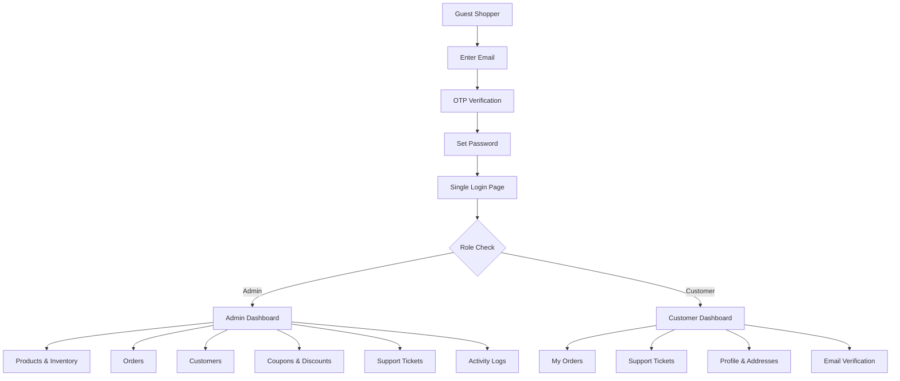
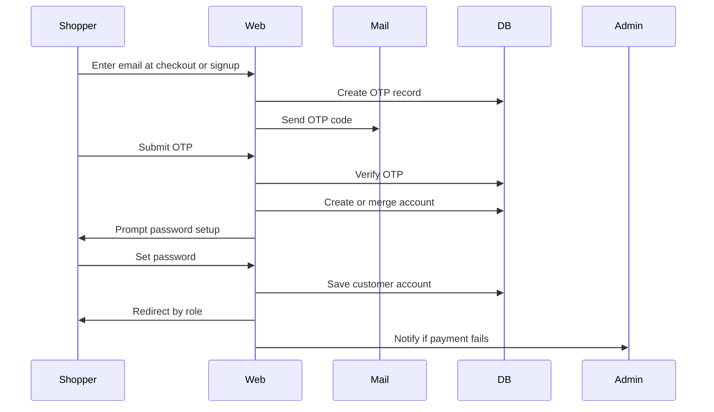
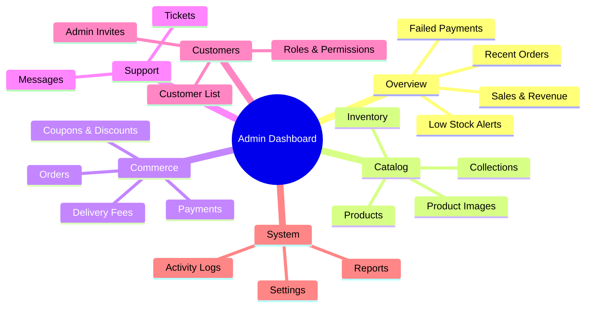
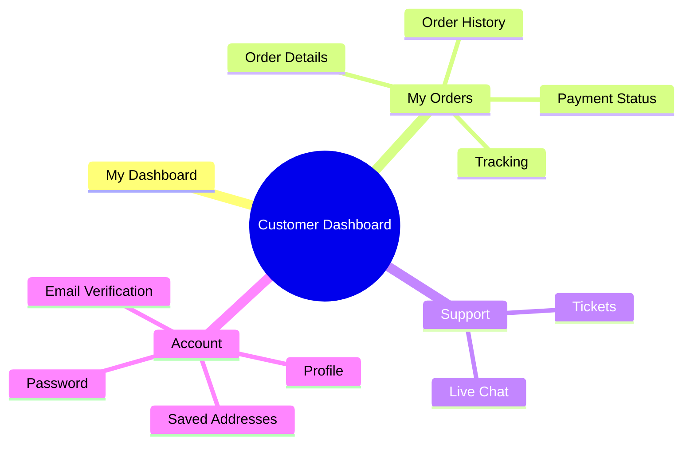
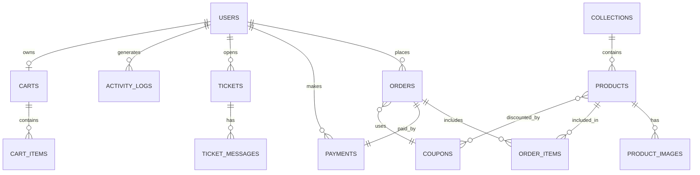

# 🪬 TATS Beeds Shop

**Modern Laravel 12 E-Commerce Platform for Beaded Jewelry & Accessories**

TATS Beeds Shop is a role-based e-commerce platform purpose-built for selling handcrafted bracelets, anklets, necklaces, and beaded accessories. Built with **Laravel 12**, **PHP 8.2**, **MySQL**, **Tailwind CSS**, **Alpine.js**, and **Vite** — it supports a smooth single-page login flow, OTP email verification, guest-to-user account merging, admin invitations, product/inventory management, orders, coupons, delivery fees, support tickets, and full audit logging.

---

## Table of Contents

- [System Snapshot](#system-snapshot)
- [Core Stack](#core-stack)
- [Main Features](#main-features)
- [Application Flow](#application-flow)
- [Dashboard Split](#dashboard-split)
- [Database Schema](#database-schema)
- [Core Tables](#core-tables)
- [Page List](#page-list)
- [Route Map](#route-map)
- [Build Order](#build-order)


---

## System Snapshot



---

## Core Stack

| Layer | Technology |
|---|---|
| Backend | Laravel 12, PHP 8.2 |
| Authentication | Laravel Breeze, Laravel Socialite |
| Database | MySQL |
| Frontend | Tailwind CSS, Alpine.js |
| Build Tool | Vite |
| Testing | Pest PHP, Mockery |
| Storage | Local Filesystem |
| Queue / Cache / Sessions | Database Driver |

---

## Main Features

- **Single login page** for both admin staff and customers
- **OTP email verification** during onboarding and checkout flows
- **Guest cart merging** — guest session data merges seamlessly into verified user accounts
- **Admin invitation system** with secure, tokenized invite links
- **Product management** — bracelet collections, anklets, necklaces, and accessories with images, pricing, colors, sizes, and stock levels
- **Order lifecycle management** — from placement through to fulfilment
- **Coupon & discount engine** — percentage and flat-rate discount codes
- **Delivery fee configuration** — region-based rules and free-delivery thresholds
- **Customer support tickets** with chat-style messaging
- **Activity logs** with timestamps for full traceability
- **Email notifications** for failed payments and order events
- **Mobile-responsive** admin and customer dashboards

---

## Application Flow



---

## Dashboard Split

### Admin Dashboard



### Customer Dashboard




## Database Schema



---

## Core Tables

### `users`

| Column | Type | Notes |
|---|---|---|
| id | bigint | Primary key |
| name | varchar | Full name |
| email | varchar | Unique |
| phone | varchar | Optional |
| password | varchar | Hashed |
| role | enum | `admin`, `customer` |
| avatar | varchar | Profile image path |
| email_verified_at | timestamp | Nullable |
| is_active | boolean | Account status |
| created_at / updated_at | timestamp | — |

### `products`

| Column | Type | Notes |
|---|---|---|
| id | bigint | Primary key |
| collection_id | bigint | FK → collections |
| name | varchar | Product name |
| slug | varchar | URL-friendly unique |
| sku | varchar | Stock-keeping unit |
| description | text | Full description |
| price | decimal | Base price |
| sale_price | decimal | Nullable |
| stock_quantity | int | Available units |
| bead_type | varchar | e.g. Glass, Crystal, Wood |
| color | varchar | Primary color |
| size | varchar | Wrist / ankle size |
| weight | decimal | Grams |
| status | enum | `active`, `draft`, `archived` |
| featured | boolean | Homepage feature flag |
| created_at / updated_at | timestamp | — |

### `orders`

| Column | Type | Notes |
|---|---|---|
| id | bigint | Primary key |
| order_number | varchar | Human-readable reference |
| user_id | bigint | FK → users |
| coupon_id | bigint | Nullable FK → coupons |
| delivery_fee_id | bigint | FK → delivery_fees |
| subtotal | decimal | Pre-discount total |
| discount | decimal | Coupon savings |
| delivery_fee | decimal | Shipping cost |
| total | decimal | Final amount charged |
| status | enum | `pending`, `processing`, `shipped`, `delivered`, `cancelled` |
| payment_status | enum | `unpaid`, `paid`, `refunded` |
| shipping_name | varchar | Recipient name |
| shipping_email | varchar | Recipient email |
| shipping_phone | varchar | Contact number |
| shipping_address | varchar | Street address |
| shipping_city | varchar | City |
| shipping_state | varchar | State / region |
| shipping_country | varchar | Country |
| notes | text | Nullable order notes |
| created_at / updated_at | timestamp | — |

### `payments`

| Column | Type | Notes |
|---|---|---|
| id | bigint | Primary key |
| order_id | bigint | FK → orders |
| user_id | bigint | FK → users |
| reference | varchar | Gateway reference |
| gateway | varchar | e.g. Paystack, Flutterwave |
| amount | decimal | Amount charged |
| currency | varchar | e.g. NGN, USD |
| status | enum | `pending`, `success`, `failed` |
| response | json | Raw gateway response |
| paid_at | timestamp | Nullable |
| created_at / updated_at | timestamp | — |

---

## Page List

### Admin Pages

| Section | Pages |
|---|---|
| Overview | Dashboard, analytics, revenue summary, recent orders, failed payments, low-stock alerts |
| Products | All products, add product, edit product, product images, inventory |
| Collections | All collections, add collection, edit collection |
| Orders | All orders, pending, processing, shipped, delivered, cancelled |
| Payments | All payments, successful, failed, refunds |
| Customers | All customers, customer details, purchase history |
| Coupons | All coupons, create coupon, coupon analytics |
| Delivery | Delivery fees, regions, free-delivery rules |
| Support | Open tickets, chat, resolved tickets |
| Admins | All admins, invite admin, roles and permissions |
| Reports | Sales report, customer report, inventory report, payment report |
| Logs | Activity logs, login logs, payment logs, error logs |
| Settings | General, email, security, branding |

### Customer Pages

| Section | Pages |
|---|---|
| Dashboard | Overview, recent orders, account status |
| Orders | Order history, order details, invoices |
| Tracking | Processing, shipped, delivered |
| Support | Create ticket, ticket history, chat |
| Profile | Personal info, saved addresses, password change |
| Verification | Verify email, resend OTP, set password |

---

## Route Map

```text
/                           → Shop homepage (featured bracelets & collections)
/shop                       → Full product listing
/shop/{slug}                → Single product page
/cart                       → Shopping cart
/checkout                   → Checkout flow

/auth/login                 → Login
/auth/register              → Register
/auth/otp                   → OTP verification
/auth/set-password          → Set initial password

/dashboard                  → Customer dashboard
/dashboard/orders           → Order history
/dashboard/orders/{order}   → Order detail & tracking
/dashboard/tickets          → Support tickets
/profile                    → Profile & account settings

/admin/dashboard            → Admin overview
/admin/products             → Product management
/admin/collections          → Collection management
/admin/orders               → Order management
/admin/payments             → Payment records
/admin/customers            → Customer management
/admin/coupons              → Coupon engine
/admin/delivery-fees        → Delivery fee config
/admin/tickets              → Support desk
/admin/admins               → Admin users & invites
/admin/reports              → Sales & analytics reports
/admin/logs                 → Activity & audit logs
/admin/settings             → Platform settings
```

---

## Build Order

1. Authentication and role-based access control
2. OTP verification and password setup flow
3. Admin dashboard shell and layout
4. Product and collection CRUD with image uploads
5. Public shop, product listing, and single product pages
6. Cart and checkout flow
7. Orders and payment gateway integration
8. Customer dashboard
9. Coupon engine
10. Delivery fee logic and region rules
11. Support tickets and chat
12. Logs, reports, and analytics
13. Admin invitation system
